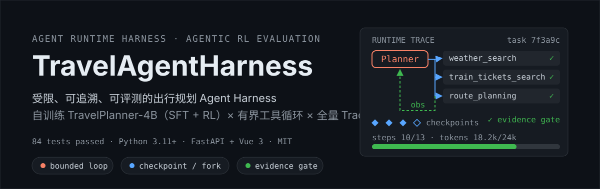
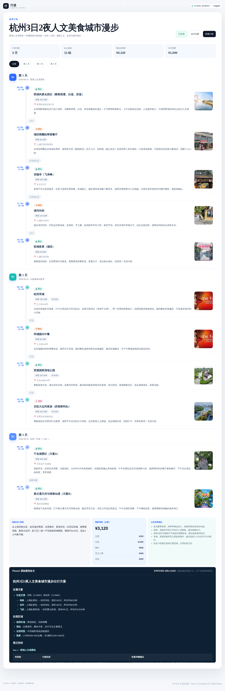

<p align="center">
  
</p>

<p align="center">
  <a href="tests/"></a>
  <a href="pyproject.toml"></a>
  <a href="LICENSE"></a>
</p>

<p align="center">
  <a href="#系统架构">系统架构</a> ·
  <a href="#harness-设计详解">Harness 设计</a> ·
  <a href="#评测结果">评测结果</a> ·
  <a href="#快速开始">快速开始</a> ·
  <a href="#文档索引">文档</a>
</p>

## 项目简介

一个可实际使用的出行规划 Agent 系统：用户输入自然语言需求（出发地、目的地、天数、预算、偏好），系统自动完成查天气、搜地点、比车次、算路线的多轮工具调用，产出有证据支撑的逐日行程，并在前端渲染为可交互的地图路线。

与常见的「Prompt + 大模型 API」旅行 Demo 不同，本项目有两个核心亮点：

1. **自己训练的规划模型**。Planner 不是调用商用大模型 API，而是基于 Qwen3-4B 经过 **SFT → Agentic RL（GRPO）** 后训练得到的 **TravelPlanner-4B**：SFT 阶段学习工具调用协议与格式，RL 阶段在真实工具循环里以过程奖励（schema 合规、工具效率、阶段感知、LLM judge 等六维子奖励）优化规划策略。
2. **Harness 运行时约束**。模型不直接面对用户，而是运行在 Harness（运行时约束框架）内：预算上限、Schema 校验、Checkpoint、全量 Trace、人工审批、证据门禁全部由框架强制执行。模型的每一次工具调用都可回溯、可恢复、可从任一检查点分叉复跑。

本仓库包含 **Harness 内核 + 评测体系 + 产品化前端**；训练代码与模型权重不在本仓库（见[模型权重](#模型权重)）。

## 系统架构

单一执行内核设计：CLI、Web 服务、离线评测三个入口共享同一个 `AgentRuntime`，不另造第二套 Agent 逻辑——页面上每个运行时状态都能回溯到同一套 Runtime 和 SQLite 状态。

```text
                        用户需求（自然语言）
                              │
        ┌──────────┬──────────┴─────────┐
        │ CLI      │ Web UI             │ 离线评测        ← 三个入口，同一内核
        │          │ Vue 3 + FastAPI/SSE│ evals/ + eval_results/
        └──────────┴──────────┬─────────┘
                              │
                    AgentRuntime（唯一执行内核）
                    ├─ 协议层    双协议解析，训练分布对齐
                    ├─ 预算护栏  4 项硬预算 · Guardrail · 人工审批
                    ├─ 工具层    8 个训练契约工具，三种数据源可切换
                    └─ 持久化    每轮 SQLite Checkpoint + 全量 Trace
                              │
                    Report Model（证据约束的结构化转换，不参与规划）
                              │
                    前端交互路线图（地图为主、文字为辅）
```

## 界面预览



更多截图见 [docs/screenshots/](docs/screenshots/)。

## 与传统方案的区别

市面上大多数「AI 旅行规划」项目，本质是写一段 Prompt 直接调用通用大模型 API——模型行为靠提示词约定，没有任何强制手段。本项目的思路是：**模型自己训练，运行时由 Harness 强制约束**。

| 维度 | 传统方案：Prompt + 大模型 API | 本项目：自训练模型 + Harness |
|---|---|---|
| **模型** | 通用大模型（GPT / DeepSeek 等），能力黑盒、行为靠提示词引导 | **TravelPlanner-4B**：Qwen3-4B 基座 → SFT 学习工具调用格式 → Agentic RL 在真实工具循环里优化规划策略 |
| **行为边界** | 无。模型可以无限循环、重复调用、超预算运行 | Harness 有界 Agent Loop：步数 / 墙钟 / 累计 Token / 工具调用数**四项硬预算**，完全相同调用第 4 次直接阻断 |
| **可靠性** | 失败即终止，无中间状态 | 每轮写入 SQLite **Checkpoint**，崩溃可恢复、可从任一 Checkpoint **Fork 复跑** |
| **可观测性** | 黑盒，只看到最终回答 | **全量 Trace**：模型轮次、工具调用、状态迁移、预算消耗、失败原因逐条落库，可回放审计 |
| **输出质量** | 模型说什么就是什么，可能凭空编造 | **证据门禁**：零取证的空想答案直接拒收；Report 阶段做 Schema 校验的结构化转换 |
| **安全** | 无防护 | 工具级输入/输出 **Guardrail**；副作用工具声明 `requires_approval` 后任务暂停，等待**人工审批**放行 |
| **评测** | 凭感觉演示 | 确定性抽样测试集 + 四路对比（基座 / SFT / RL / DeepSeek）+ 逐条数据全部公开可复跑 |

## Harness 设计详解

### 运行时内核：有界状态机

- **六态状态机**：`created → running → (waiting_approval) → completed / exhausted / failed`，每次迁移落 Trace
- **四项硬预算**：步数 13 轮（与训练契约 `max_turns=13` 对齐）、墙钟秒数、累计 Token、物理工具调用数 40 次，任一耗尽任务进入 `exhausted` 而非失控运行
- **三阶段工具执行**：Phase 1 顺序门禁（预算 / 重复 / Schema / 审批检查，不改消息）→ Phase 2 线程池**并行执行**（纯函数、无副作用）→ Phase 3 按原始调用顺序**有序合并**结果。既拿到并行性能，又不破坏训练契约要求的消息顺序
- **重复循环检测**：对每轮「调用 + 观测」计算 SHA-256 轮签名，连续 3 轮完全相同先注入一次训练原文的强制作答机会，再犯即终止——与 RL 训练循环的重复处理分支逐字一致
- **每轮 Checkpoint**：每轮结束将整份状态快照写入 SQLite；崩溃后 `resume` 恢复，`fork` 可从任一 Checkpoint 分叉出新任务复跑

### 协议层：让 RL 模型待在训练分布内

- **双协议**：原生 Function Calling（托管 API），或训练模型的 `<tool_call>` / `<answer>` 文本协议
- **tagged 解析器完整复刻训练循环的容错语义**：`<tool_calls>` 复数包裹、` ``` ` 代码围栏、`{"tool"/"parameters"}`、`{"tool_name"/"tool_input"}` 等六种变体、未闭合 `<answer>` 视为最终答案、json_repair 兜底
- **解析失败不静默重采样**：把训练原文引导消息（如「请先通过 tool_call 调用至少一个工具…」）注入对话后重问，模型收到的是它训练时见过的确切措辞
- **观测翻译**：Runtime 内部统一保存 provider-neutral JSON，仅在协议边界把 tool 消息渲染回训练侧 `<tool_response>` 格式（json2md + 头尾各 2500 字截断——尾部常含价格与结论，必须保尾）
- **截断自愈**：`finish_reason=length` 的截断输出自动以 1.5× 预算重发一次，让闭合标签落地

### 工具层：契约逐字一致，实现可替换

- 8 个工具的 name / description / JSON Schema 与 RL 训练环境**逐字一致**——训练过的模型不会因契约漂移而出分布
- 每次调用过完整 JSON Schema 校验（required / enum / 数值范围 / 嵌套数组元素类型）
- **schema-echo 护栏**：模型把工具定义当参数复读时（tagged RL 模型在字段式输入下的典型 OOD 失败模式），收到明确的中文改错消息而非含糊报错——压测中场均拦截 0.6 次，全部自愈
- **data_source 输出护栏**：任何工具结果必须标明数据来源（`demo_fixture` / `amap_web_service` / `firecrawl_*` / `llm_ticket_simulator`），证据边界贯穿到最终报告
- **三种数据源热切换**：确定性离线 fixtures（测试与演示）↔ 高德 Web 服务（真实地理四工具）↔ Firecrawl（真实网页检索）；高德并发 QPS 限流（infocode 10021）由 provider 级指数退避（0.4/0.8/1.6s）吸收为延迟而非失败

### 持久化与可追溯

- SQLite（WAL 模式）三表：`tasks` / `checkpoints` / `traces`；Checkpoint 是整份状态快照，Trace 按 `(task_id, id)` 索引支持增量游标拉取（SSE 轮询用）
- 20 余种 Trace 事件：`model_request` / `model_response` / `tool_started` / `tool_succeeded` / `tool_blocked` / `state_transition` / `budget_exhausted` / `approval_required` …
- 写入前自动脱敏：`sk-*` 密钥、`Bearer` token、`api_key` 字段统一替换为 `[REDACTED]`

### Report 层：规划与展示分离

- Planner 只产出规划文本；Report Model（temperature=0，JSON mode）把结果整理为受校验的路线 JSON——**不重新规划**，失败保留原文
- `normalize_report` 强规范化：坐标范围校验（非法置空）、站点类别白名单、任一站点缺坐标时整体降级为示意地图（`map_kind=schematic`）、alerts / budget 条数上限
- 高德模式下对站点做 `poi_snapshot` 富化（真实图片 / 地址，best-effort，失败静默跳过）

### Web/API 层

- FastAPI 全异步边界：`POST /api/plans` 202 异步受理，`GET /api/plans/{id}/events` 以 SSE 每 0.65s 推送增量 Trace 与状态
- **并发模型**：worker 线程池（默认 2，可配）+ `BoundedSemaphore` 有界队列，超额直接 **503 + `Retry-After: 30`** fail-fast，不静默排队
- worker 内未捕获异常会把任务落库为 `FAILED` 并追加 `runtime_failed` Trace——异常不丢状态
- **前端输入清洗护栏**：自由文本剥离标记符号、按数据集口语句式拼接（相对日期、逗号短句、人均预算），避免字段式模板把 RL 模型拖出训练分布

## 训练环境对齐

评测 RL 模型时建议全开（默认关）。原因：RL Planner 只见过训练侧的观测分布与终局规则——训练中火车票根本不是真实 API，而是 LLM 模拟器生成的；网页不是原始 markdown，而是经 LLM 提炼的 JSON。评测时若不把这套环境搬过来，测的就不是模型的真实水平。

| 开关 | 作用 |
|---|---|
| `FORCE_ANSWER_AFTER_STEPS=12` | 第 12 轮注入训练原文强制收尾消息 |
| `REPEAT_ANSWER_CHANCE=true` | 重复循环时给一次强制作答机会（训练原文） |
| `MAX_TOOL_OUTPUT_CHARS=5000` | tool_response 截断长度（json2md 头+尾） |
| `VISIT_EXTRACTOR=true` | visit 页面由 LLM 按训练 EXTRACTOR_PROMPT 提炼 |
| `TICKET_SIMULATOR=true` | 火车/航班用训练同款 LLM 模拟器（逐字 prompt） |
| `TRAINING_TOOL_FORMAT=true` | search/visit 观测用训练侧文本格式 |
| `CURRENT_DATE=...` | 固定 Planner Prompt 里的当前日期（评测用） |

解析失败/空输出时模型收到训练原文引导消息并被重问，不再静默重采样。

## 评测结果

测试集：[eval_results/test_final.jsonl](eval_results/test_final.jsonl) 80 条中确定性抽样 10 条（指纹 `b7d3c735…e0ef4303`）；工具链为真实外部 API（高德 + Firecrawl）；judge=deepseek-v4-flash；运行环境已全开训练对齐开关。脚本与逐条数据在 [eval_results/](eval_results/README.md)。

### 基座 → SFT → RL 四路对比（DeepSeek 作参照）

| 指标 | 基座 Qwen3-4B | SFT 阶段 | **TravelPlanner-4B (RL)** | DeepSeek |
|---|---:|---:|---:|---:|
| 完成率 | 1.0 | 0.8 | 0.9 | 0.9 |
| 必需工具覆盖率 | 0.65 | 0.69 | **0.775** | **0.775** |
| 工具错误率 | 0.02 | 0.34 | 0.12 | 0.05 |
| 重复调用阻断 | 0 | 12 | **1** | 0 |
| RL 混合分（phase3） | 0.419 | 0.223 | **0.480** | 0.461 |
| LLM judge | 0.48 | 0.27 | **0.60** | 0.57 |

全开训练环境对齐开关后，TravelPlanner-4B 在必需工具覆盖率上追平 DeepSeek，RL 混合分与 LLM judge 分反超，评测结论与训练侧 80 条 judge 结果一致、可复现。逐条明细：[eval_results/compare_report.md](eval_results/compare_report.md)。

### 工程压测（对齐版，2026-09-08）

| 结论 | 数据 |
|---|---|
| 模型不是瓶颈 | 裸 vLLM c8 首轮 2.3s / 6101 tok/s；Agent 循环下 GPU 均值仅 12~24% |
| 瓶颈在外部工具链 | 工具耗时为模型的 6~9 倍（含训练同款 LLM 模拟器往返） |
| Harness 开销 ≈ 0 | 逐任务「墙钟 − 模型 − 工具」均值 -11%~+0.7% |
| 并发甜区 | c4 吞吐见顶 128 tasks/h；HTTP 路径 worker=16 时 **645 tasks/h、queueing ~3s**（worker=2 时 42.6 tasks/h、queueing 286s，15×） |
| 护栏有效 | schema-echo 场均拦截 0.6 次全部自愈；重复阻断/强制收尾/作答机会按训练契约触发 |
| Prefix cache | 命中率 87.3%，多轮 prefill 的主要减压阀 |

完整报告：[eval_results/perf/perf_report.md](eval_results/perf/perf_report.md)（对齐前旧版归档于 `eval_results/perf/archive_20260906/`）。

## 快速开始

Python 3.11+：

```bash
python -m venv .venv
.venv/bin/pip install -r requirements.txt   # 或 pip install -e '.[test]'
```

启动网页（默认只绑定本机；Demo 无鉴权，请勿暴露公网）：

```bash
.venv/bin/travel-harness --env-file .env serve --host 127.0.0.1 --port 8765
# 浏览器访问 http://127.0.0.1:8765
```

命令行直接运行：

```bash
.venv/bin/travel-harness --env-file .env run "明天从上海出发去杭州玩两天，2人，预算人均800元"
```

常用命令：

```bash
travel-harness trace <task-id>          # 查看轨迹
travel-harness checkpoints <task-id>    # 查看检查点
travel-harness resume <task-id>         # 恢复任务
travel-harness fork <task-id> --checkpoint 2
python -m unittest discover -s tests    # 84 个单测
```

配置全部走 `.env`（[.env.example](.env.example) 有完整注释），读取优先级：命令行参数 > `TRAVEL_HARNESS_*` > `AGENT_*` > `OPENAI_*`。

### 接入真实数据

```text
TRAVEL_HARNESS_TOOL_PROVIDER=amap        # 高德 Web 服务（地理四工具）
TRAVEL_HARNESS_AMAP_KEY=<your-key>       # 「Web 服务」类型，勿提交仓库
TRAVEL_HARNESS_SEARCH_PROVIDER=firecrawl # 真实网页检索
TRAVEL_HARNESS_FIRECRAWL_KEY=<your-key>
```

### 模型权重

训练权重不进本仓库。部署目录约定（打包归档中为空目录占位）：

```text
models/
└── checkpoint-150/        # TravelPlanner-4B 最终权重（Qwen3-4B 基座，SFT + RL，bf16）
```

用 vLLM 暴露 OpenAI-compatible API（RTX 5090 需 `VLLM_USE_FLASHINFER_SAMPLER=0`，详见 [docs/deploy-vllm-server.md](docs/deploy-vllm-server.md)）：

```bash
python -m vllm.entrypoints.openai.api_server \
  --model models/checkpoint-150 --served-model-name travel-planner \
  --max-model-len 50000 --port 8000
```

```text
TRAVEL_HARNESS_PLANNER_MODE=vllm    # 自动填入 tagged 协议、base_url、采样参数
```

无 GPU 时默认 `PLANNER_MODE=api` 直连 DeepSeek 等托管 API，同样可跑全链路。

## 仓库结构

```text
├── src/travel_agent_harness/   # Harness 内核
│   ├── runtime.py              #   唯一执行内核：有界状态机、三阶段工具执行、重复循环检测
│   ├── protocol.py             #   双协议解析、观测翻译、训练原文引导消息
│   ├── tools.py                #   8 个训练契约工具、Schema 校验、Guardrail
│   ├── store.py                #   SQLite 持久化：Checkpoint / Trace / 恢复 / Fork
│   ├── reporting.py            #   Report Model 结构化转换与规范化
│   ├── amap.py / firecrawl.py  #   真实数据源 provider（高德 / Firecrawl）
│   ├── simulator.py / extractor.py  # 训练对齐：LLM 票务模拟器、网页提炼器
│   ├── api/                    #   FastAPI 服务（任务、SSE、审批、Inspector）
│   └── web_dist/               #   前端构建产物（pip 用户无需 Node）
├── frontend/                   # Vue 3 + Vite + TypeScript 源码（改前端才需要 Node）
├── tests/                      # 84 个单元测试（unittest，无外部依赖）
├── evals/                      # CLI eval 固定用例
├── eval_results/               # 评测/压测脚本 + 全部结果与报告
├── docs/                       # 部署、验证、并发、证据台账等文档 + 截图
├── models/                     # （打包为空）模型权重放置目录，见「模型权重」
├── .env.example                # 全部配置项注释
└── requirements.txt
```

## 文档索引

| 文档 | 内容 |
|---|---|
| [docs/deploy-vllm-server.md](docs/deploy-vllm-server.md) | vLLM 部署与接入 |
| [docs/concurrency-techniques.md](docs/concurrency-techniques.md) | 并发优化调研与落地映射 |
| [docs/evidence-ledger.md](docs/evidence-ledger.md) | 可公开边界与 Claim 证据 |
| [docs/verification.md](docs/verification.md) | 三次真实运行的验证记录 |
| [docs/2026-09-07-overnight-summary.md](docs/2026-09-07-overnight-summary.md) | 训练对齐改造全程记录 |
| [eval_results/README.md](eval_results/README.md) | 评测产物总索引 |

## 安全说明

- `.env` 已在 `.gitignore` 中；任何真实 API Key 不应提交仓库（[.env.example](.env.example) 为模板）
- Trace 自动脱敏疑似 API Key；Web Demo 无鉴权，默认绑定 127.0.0.1，请勿直接暴露公网

## License

MIT，见 [LICENSE](LICENSE)。
